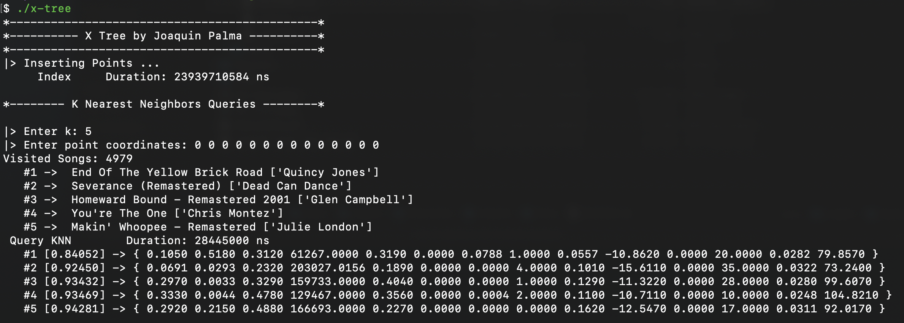
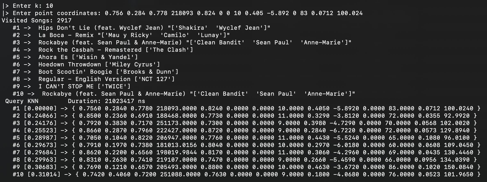
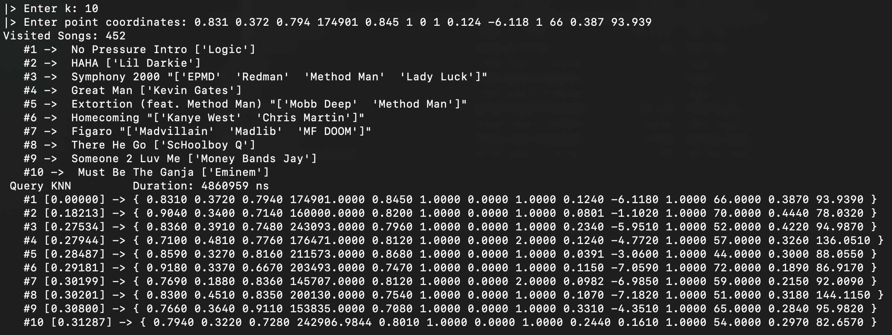

# X-tree

The present project indexes 170,653 spotify songs within an X-tree and allows querying the k-nearest neighbors for a given point. The original file can be found in the following [website](https://www.kaggle.com/yamaerenay/spotify-dataset-19212020-160k-tracks). For this project, some modifications were made to the csv file for its correct reading and insertion into the tree, the modified file `spotify_dataset_cut.csv` can be downloaded [here](https://drive.google.com/file/d/1VmkI-7iu7XPfoQFpg2IYUA5UPH8JKy6f/view?usp=sharing).

The  dataset columns are in the following order: *valence, acousticness, danceability, duration_ms, energy, explicit, instrumentalness, key, liveness, loudness, mode, popularity, speechiness, tempo, year, name, artists*. The first 14 attributes (dimensions) are numeric, therefore, considered for indexing, the last 3 attributes are used for song identification. To read the file, the separating commas must be replaced by spaces. This can be done using the `tr` command:
```bash
$ cat spotify_dataset_cut.csv | tr "," " " > spotify_dataset.csv
```
Once this repository is cloned, the resulting `spotify_dataset.csv` file have to be placed in the root path. Now, everything is ready to run the project:
```bash
$ cmake -B build
$ cd build
$ make
$ ./x-tree
```
---
### Executable Structure

First, the points are normalized and inserted within the X-tree, this operation takes approximately 30 seconds. Once the points are uploaded, one can perform the k-NN queries. Each query has 2 parameters, `k` and the point coordinates (14 floating numbers). The description of each dimension can be found in the [Kaggle page](https://www.kaggle.com/yamaerenay/spotify-dataset-19212020-160k-tracks). 



The results show 4 important things: the number of registers visited during the query execution, the data of the `k` most similar songs, the query execution time, and the distance from the query point to each of the `k` neighbors.



It is important to highlight that queries over sparse spaces (songs with particular attributes) are much faster because they visit fewer points to get the results.



---
### References
- Beckmann, N., Kriegel, H. P., Schneider, R., & Seeger, B. (1990, May). *The R\*-tree: an efficient and robust access method for points and rectangles.* In Proceedings of the 1990 ACM SIGMOD international conference on Management of data (pp. 322-331).
- Berchtold, S., Keim, D. A., & Kriegel, H. P. (1996). *The X-tree: An index structure for high-dimensional data.* In Very Large Data-Bases (pp. 28-39).
- Guttman, A. (1984, June). *R-trees: A dynamic index structure for spatial searching*. In Proceedings of the 1984 ACM SIGMOD international conference on Management of data (pp. 47-57).
- Roussopoulos, N., Kelley, S., & Vincent, F. (1995, May). *Nearest neighbor queries*. In Proceedings of the 1995 ACM SIGMOD international conference on Management of data (pp. 71-79).
